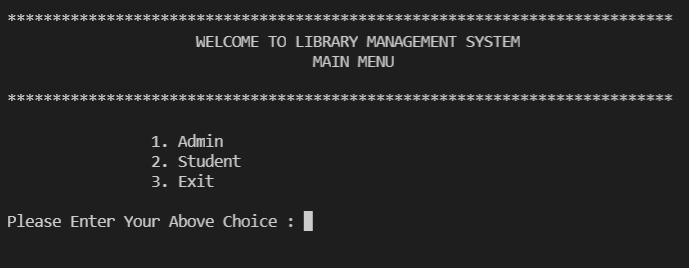
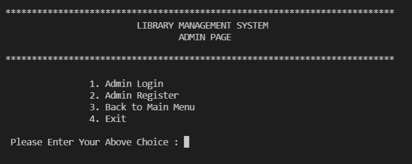
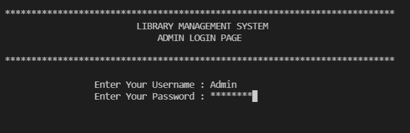
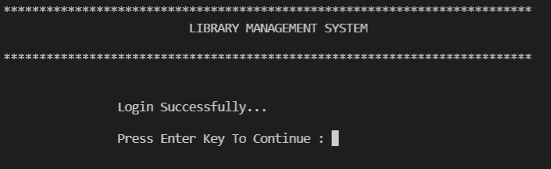
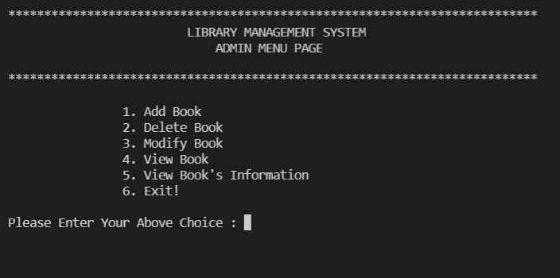
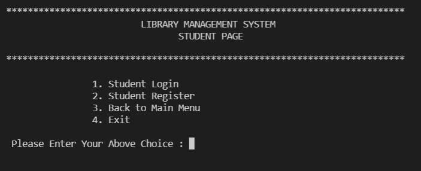
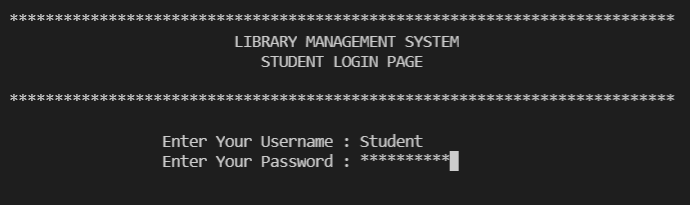
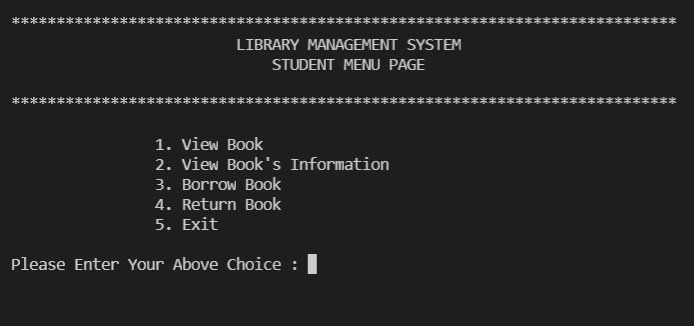

# Library Management System

Library Management System is a software which handles the entire data of library.

Designed and developed Library Management System consisting the **Student portal and Admin portal**.


# About Project

In this project,We have two type of Users first Admin and second Student.Admin can add books, delete books, modify books, get list of all books and also view individual book details.Student can also view the list of all books, view individual book details, borrow book and return book. So we have created a menu to select a user whether he/she is an Admin or Student.
Both user can register with username and password.So we have created separate register page for Admins and Students.
Both user can login with username and password which will give them access to the library management system.So we have created separate login page for Admins and Students.

This project uses file handling to store the data of users and books.All the information added or removed will be updated in the database.

<h4>Code Explanation (Inheritance, Polymorphism)</h4>

- I have created the Book class as a base class, and then derived a new class, and FileManagement class, used to store various information, in this program, I still use file storage. In the process of adding, deleting, modifying, and checking books and the program will modify the information in the text file accordingly.

- Then in order to distinguish different users for different operations, the user initially logs in, and the system distinguishes users with different roles according to the user’s account to enter different user interfaces.This function can use virtual functions to achieve polymorphism.

- Admin can add books, delete books, modify books, get list of all books and also view individual book details.
- Student can also view the list of all books, view individual book details, borrow book and return book.

- The description of the class is as follows:-

  - User class save the user's account and password attributes (private), and provide corresponding set and get methods, and the following functions:-
     - viewBooks(vector<Book *> Books) - View all book information
     - viewBookInfo() - View book information
     - Register(string account, string password) - Different user Register
     - Login()  - Different user login
     - display() - Show different user interfaces
   
  - Student inherits from User, rewrite display(), and add the following functions:-
  
     - BorrowBook() -  To issue book from Library.
     - ReturnBook() -  The function of returning the book.
   
  - Admin also inherits from User, rewrite display(), and add the following functions:-
     - addBook()    - Add books in Library.
     - deleteBook() - Delete book from Library.
     - reSetBook()  - Modify book.
    
   - Book is the base class of all book classes, with various properties of the book, and provides corresponding set, get methods and virtual functions toString().
   - CSE, ECE, Electrical, Mechanical, Chemical and Civil inherit from Book, and rewrite toString().
   - Five types of FileManagement:-
   
     - void saveUserInfo(map<string, string> &accounts) - To store user data in the database.
     - map<string, string> getPeopleInfo() - is responsible for reading the user file user.txt information.
     - vector<Book *> getBooks() -  is responsible for reading the book information file book.txt.
     - void saveBooks(vector<Book *> vec) -  save the modifications to the book information.
     - Book * getObject(string ID) -  according to the ID information of the book, return the corresponding type of object pointer.


In order to run this project, you must have installed **VS Code** on your PC.(We recommend these IDE).For the project demo, have a look at the image slider below.


## Features
- **Users**
    - Username
    - Password


- **Types of user**
    - Admin
    - Student


- **Admin**
     - Admin Register account or Signup (with username,password)
     - Admin Login (with username,password)
     - Add Books
     - Delete Book
     - Modify Book
     - View Books (Get list of all books)
     - View Book's Information (Individual Book details)

- **Student**
     - Student Register account or Signup (with username, password)
     - Student Login (with username, password)
     - View Books (Get list of all books)
     - View Book's Information (Individual Book details)
     - Borrow Book (using Book's Number)
     - Return Book

- **Key Points**
     - **OOPs Concepts : Inheritance, Polymorphism, Access specifiers etc**.
     - **File Handling** to store user and books data.


# Output

<div align="center"> <h3>ADMIN INTERFACE </h3> </div>
  
<div align="center">
   
  
  
 
  
</div>
 
 <div align="center"> <h3>STUDENT INTERFACE </h3> </div>

<div align="center">





</div>
 


## Prerequisites
 - C++ IDE
   - [VS Code (Visual Studio Code)](https://code.visualstudio.com/docs/?dv=win)
   - Install following extensions : -
      - C/C++
      - Code runer
      - C/C++ Makefile Project 
    - Go to manage setting and open Command Palette -type create c++ project and select folder for creating project.
 - MinGW Compiler
   - [MinGW-w64](https://sourceforge.net/projects/mingw-w64/)
   - Now you need to set the environment variables, so for which you need to paste the bin path.In bin folder "make.exe" must be otherwise you will find the error such as "'make' is not recognized as an internal or external command".
   - To avoid above such error we simply do following : -
        -  Make another copy of C:\MinGW\bin\mingw32-make.exe file in the same folder.
        -  Rename the file name from mingw32-make.exe to make.exe.
        -  Run make command again.
        -  [For more details click here.](https://stackoverflow.com/questions/23723364/windows-7-make-is-not-recognized-as-an-internal-or-external-command-operabl)
    


## Compile and Run Program
**After generating project and implementing the code we simply do following two steps : -**
-  To Compile the Program, type

```bash
  make
```

-  To run the Program, first change the directory and go to ouput folder where your **'main.exe'** file exits.For changing the directory,type **cd output** and for running the Program,type

```bash
  ./main
```
 *where ./ represents present working directory and 'main' is the executable target file.*
 
 


